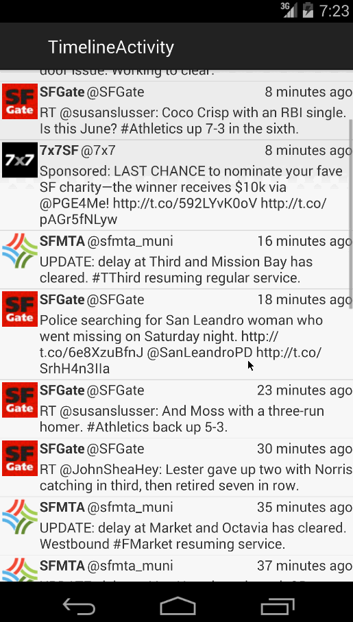

SimpleTwitterClient
===================

This is a simple Twitter Client that allows the user to view their timeline and post tweets. It is using the [Twitter REST API](https://dev.twitter.com/rest/public).

Time spent: too many yet not enough hours spent in total

Updated 10/07/2014

 * [x] User can switch between Timeline and Mention views using tabs.
 * [x] User can view their home timeline tweets.
 * [x] User can view the recent mentions of their username.
 * [x] User can scroll to bottom of either of these lists and new tweets will load ("infinite scroll")
 * [x] User can navigate to view their own profile
 * [x] User can see picture, tagline, # of followers, # of following, and tweets on their profile.
 * [ ] User can click on the profile image in any tweet to see another user's profile.
 * [x] User can see picture, tagline, # of followers, # of following, and tweets of clicked user.
 * [x] Profile view should include that user's timeline

Completed user stories:

 * [x] User can sign in to Twitter using OAuth login
 * [x] User can view the tweets from their home timeline
 * [x] User should be displayed the username, name, and body for each tweet
 * [x] User should be displayed the relative timestamp for each tweet "8m", "7h"
 * [x] User can view more tweets as they scroll with infinite pagination
 * [x] User can compose a new tweet
 * [x] User can click a “Compose” icon in the Action Bar on the top right
 * [x] User can then enter a new tweet and post this to twitter
 * [x] User is taken back to home timeline with new tweet visible in timeline

Walkthrough of all user stories:

GIF created with [LiceCap](http://www.cockos.com/licecap/).
